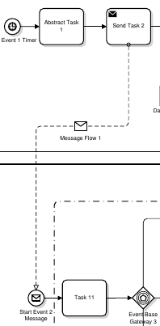

BPMN 2.0 Extension for Envelope Decorator Bounds
================================================

link:envelope-decorator-bounds/bpmn-envelope-decorator-bounds.xsd[XML Schema including full Documentation]

link:https://falko.github.io/bpmn-extensions/envelope-decorator-bounds/bpmn-envelope-decorator-bounds.html[HTML Documentation generated out of XML Schema]

This XML schema defines and documents BPMN 2.0 extension elements and
attributes to overcome limitations of BPMN Diagram Interchange.

In particular, the attribute envelopeDecoratorBounds allows to interchange the position and dimensions
of the envelope decorator on a BPMN Message Flow.
With this extension the Envelope Decorator can be freely positioned
along the Message Flow and not just in the middle of it.

link:envelope-decorator-bounds/bpmn-envelope-decorator-bounds.bpmn[Example BPMN File]

[source,xml]
----
<bpmndi:BPMNEdge bpmnElement="_09e7cb23-4a1b-4165-b93a-cf635c223ee5" messageVisibleKind="initiating" id="E1373638081031__09e7cb23-4a1b-4165-b93a-cf635c223ee5">
    <extensionElements>
        <deco:evelopeDecoratorBounds height="12" width="17" x="209" y="336.0"/>
    </extensionElements>
    <di:waypoint x="305.0" y="188.0"/>
    <di:waypoint x="305.0" y="342.0"/>
    <di:waypoint x="130.0" y="342.0"/>
    <di:waypoint x="131.0" y="651.0"/>
    <bpmndi:BPMNLabel labelStyle="LS1373638080849">
        <dc:Bounds height="12.804751171875008" width="94.93333333333335" x="167.10533963254568" y="359.56612835107035"/>
    </bpmndi:BPMNLabel>
</bpmndi:BPMNEdge>
----
